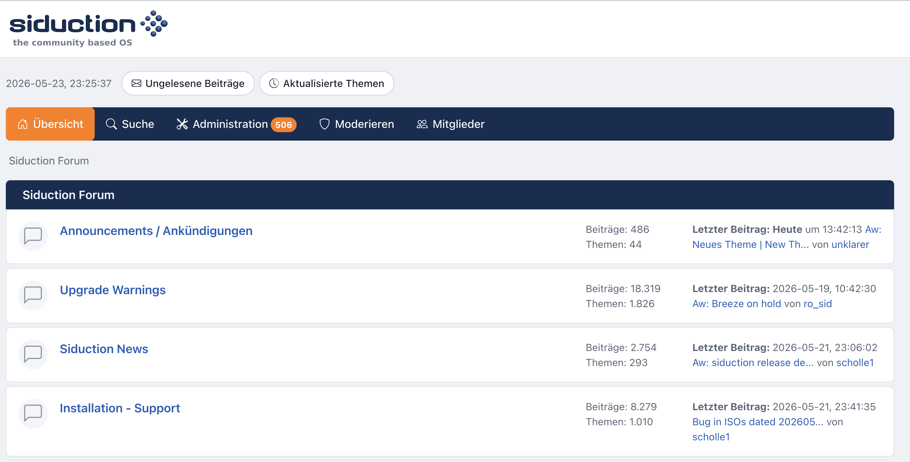

# siduction forum theme

A Bootstrap-flavoured theme for [SMF 2.1](https://www.simplemachines.org/), made for the
[siduction](https://siduction.org/) community forum.

It re-skins the default SMF look with a flatter, card-based layout, a light/dark
colour scheme, and an icon font in place of the bitmap sprites. Nothing is wired
up with inline scripts or styles, so the forum can be served under a strict
Content-Security-Policy.

## Features

- Light and dark colour schemes. *Auto* follows the operating system; a toggle in
  the top bar lets visitors force light or dark, remembered per browser.
- Colours live in CSS custom properties, so both schemes share one set of
  component rules and are easy to retheme.
- [Bootstrap Icons](https://icons.getbootstrap.com/), bundled as a single woff2,
  replace SMF's `` icon sprites — post icons, board status icons and the
  editor toolbar included.
- Smileys render as Unicode emoji instead of GIFs. A small service worker keeps
  the browser from fetching the original smiley images at all.
- CSP-friendly: no inline `<script>`, no inline styles, no `on*` handlers.
  `script-src 'self'; style-src 'self'` is enough.
- Responsive, with a collapsible menu on small screens, plus right-to-left
  support for RTL languages.
- SVG logo that swaps between a light and a dark variant.

## Requirements

- SMF 2.1.x
- A reasonably current browser. The CSS leans on `:has()` and logical properties;
  older browsers still get a usable, if plainer, layout.

## Installation

1. Copy the `siduction` folder into your forum's `Themes/` directory, so you end
   up with `Themes/siduction/`.
2. In the admin panel, go to **Admin → Configuration → Themes and Layout →
   Manage and Install**.
3. Under **Install a New Theme**, pick *siduction* from the themes found on the
   server and install it.
4. Set it as the default, or let members choose it, from the same page.

The theme ships its own English and German strings for the colour-scheme labels;
everything else uses your forum's existing language packs.

## The smiley service worker

Smileys are swapped to emoji in the page itself, so that part works everywhere.
On top of that, `scripts/sw.js` answers requests for the old smiley GIFs with an
empty image, so they never reach the network.

To cover the whole site the worker has to be served with `Service-Worker-Allowed: /`.
On Apache that header comes from `scripts/.htaccess`, which is included. On nginx
or other servers, set the same header for `scripts/sw.js` yourself — or leave it,
the emoji show up either way.

## Customising

Open `css/index.css` and look at the `:root` block near the top. The brand
colours, surfaces, text colours, radii and fonts are all there as variables, and
the dark scheme overrides the same names a little further down. Change them in one
place and the rest of the theme follows.

## Credits

- Made for the [siduction](https://siduction.org/) forum.
- Icons from [Bootstrap Icons](https://icons.getbootstrap.com/) (MIT).
- Runs on [Simple Machines Forum](https://www.simplemachines.org/).
